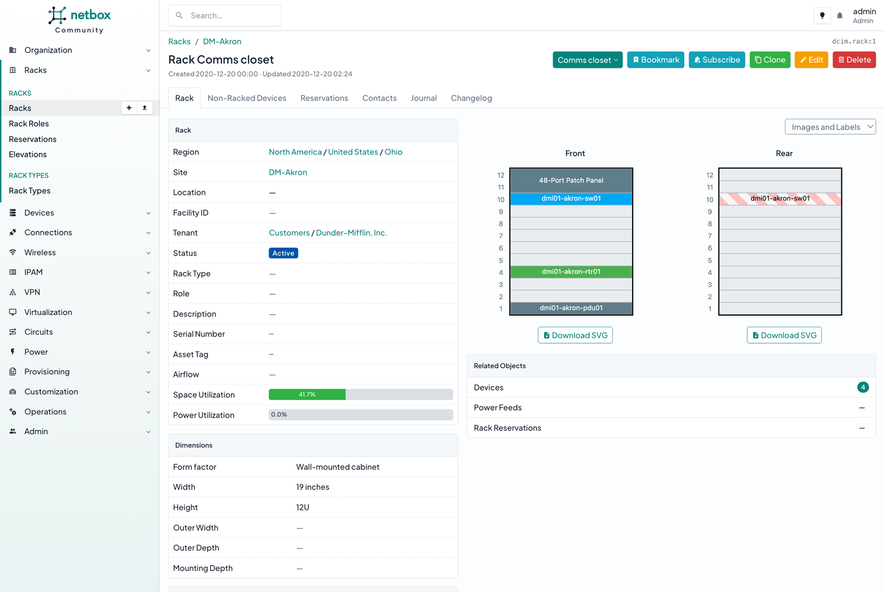
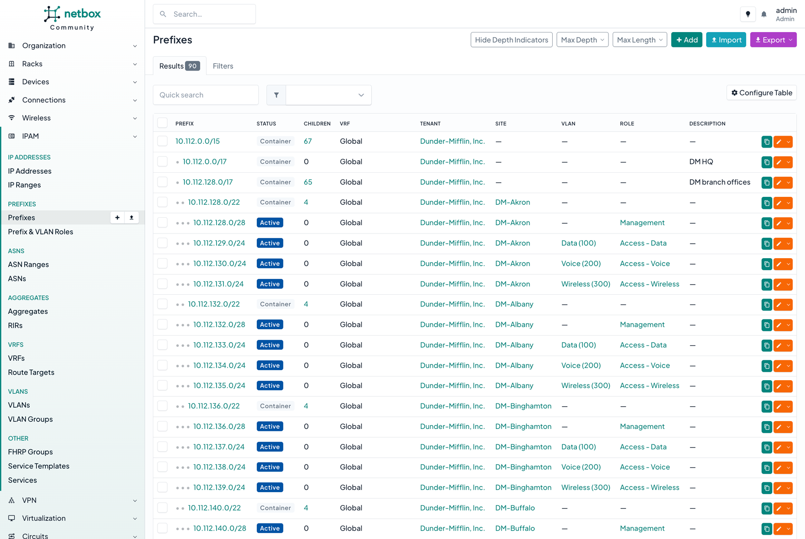
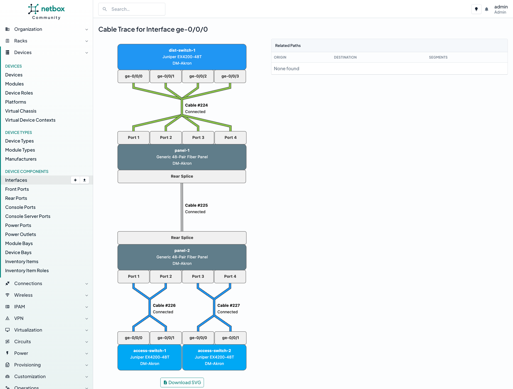

  
  
<strong>The cornerstone of every automated network</strong>

  
  
  
  
  
  
  

NetBox exists to empower network engineers. Since its release in 2016, it has become the go-to solution for modeling and documenting network infrastructure for thousands of organizations worldwide. As a successor to legacy IPAM and DCIM applications, NetBox provides a cohesive, extensive, and accessible data model for all things networked. By providing a single robust user interface and programmable APIs for everything from cable maps to device configurations, NetBox serves as the central source of truth for the modern network.

  

  <a href="#why-netbox">Why NetBox?</a> |
  <a href="#getting-started">Getting Started</a> |
  <a href="#get-involved">Get Involved</a> |
  <a href="#project-stats">Project Stats</a> |
  <a href="#screenshots">Screenshots</a>

## Why NetBox?

### Comprehensive Data Model

Racks, devices, cables, IP addresses, VLANs, circuits, power, VPNs, and lots more: NetBox is built for networks. Its comprehensive and thoroughly inter-linked data model provides for natural and robust modeling of myriad network primitives that just can't be matched by general-purpose tools. And there's no need to waste time contemplating how to set up your database: Everything is ready to go upon installation.

### Focused Development

NetBox strives to meet a singular goal: Provide the best available solution for making network infrastructure programmatically accessible. Unlike "all-in-one" tools which awkwardly bolt on half-baked features in an attempt to check every box, NetBox is committed to its central focus. NetBox provides the best possible solution for modeling network infrastructure, and provides rich APIs for integrating with tools that excel in other areas of network automation.

### Extensible and Customizable

Of course, no two networks are exactly the same. Users are empowered to extend NetBox's native data model with custom fields and tags to best suit their unique needs. You can even write your own plugins to introduce entirely new models and functionality!

### Flexible Permissions

NetBox includes a fully customizable permission system, which affords administrators incredible granularity when assigning roles to users and groups. Want to restrict certain users to working only with cabling and not be able to change IP addresses? Or maybe each team should have access only to a particular tenant? NetBox enables you to craft roles as you see fit.

### Custom Validation & Protection Rules

The data you put into NetBox is crucial. In addition to its robust native validation rules, NetBox provides mechanisms for administrators to define their own custom validation rules for objects. Custom validation can be used both to ensure new or modified objects adhere to a set of rules, and to prevent the deletion of objects which don't meet certain criteria. (For example, you might want to prevent the deletion of a device with an "active" status.)

### Device Configuration Rendering

NetBox can render user-created Jinja2 templates to generate device configurations from its own data. Templates can be uploaded individually or pulled automatically from an external source, such as a git repository. Rendered templates can be retrieved via the REST API for application directly to network devices via a provisioning tool such as Ansible or Salt.

### Custom Scripts

Complex workflows, such as provisioning a new branch office or allocating a new address block, can be tedious to carry out via the user interface. NetBox allows you to write and upload custom scripts that can be run directly from the UI. Scripts prompt users for input and then automate the necessary tasks to greatly simplify otherwise burdensome processes.

### Automated Events

Users can define event rules to automatically trigger a custom script or outbound webhook in response to a NetBox event. For example, you might want to automatically update a network monitoring service whenever a new device is added to NetBox, or update a DHCP server when an IP range is allocated.

### Comprehensive Change Logging

NetBox automatically logs the creation, modification, and deletion of all managed objects, providing a thorough change history. Changes can be attributed to the executing user, and related changes are grouped automatically by request ID.

## Getting Started

  
  &nbsp;&nbsp;&nbsp;&nbsp;&nbsp;&nbsp;&nbsp;&nbsp;&nbsp;&nbsp;
  
  &nbsp;&nbsp;&nbsp;&nbsp;&nbsp;&nbsp;&nbsp;&nbsp;&nbsp;&nbsp;
  

* Just want to explore? Check out [our public demo](https://demo.netbox.dev/) right now!
* The [official documentation](https://docs.netbox.dev) offers a comprehensive introduction.
* Check out [our wiki](https://github.com/netbox-community/netbox/wiki/Community-Contributions) for even more projects to get the most out of NetBox!

## Get Involved

* Follow [@NetBoxOfficial](https://twitter.com/NetBoxOfficial) on Twitter!
* Join the conversation on [the discussion forum](https://github.com/netbox-community/netbox/discussions) and [Slack](https://netdev.chat/)!
* Already a power user? You can [suggest a feature](https://github.com/netbox-community/netbox/issues/new?assignees=&labels=type%3A+feature&template=feature_request.yaml) or [report a bug](https://github.com/netbox-community/netbox/issues/new?assignees=&labels=type%3A+bug&template=bug_report.yaml) on GitHub.
* Contributions from the community are encouraged and appreciated! Check out our [contributing guide](CONTRIBUTING.md) to get started.

## Project Stats

  
  
  
  
   Stats via <a href="https://repography.com">Repography</a>

## Screenshots

")

