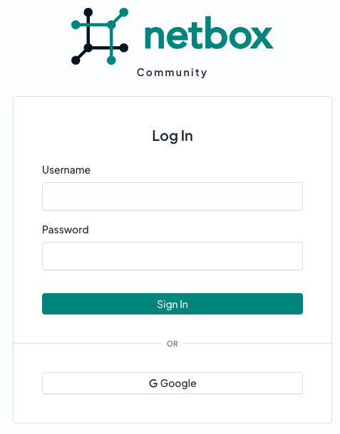
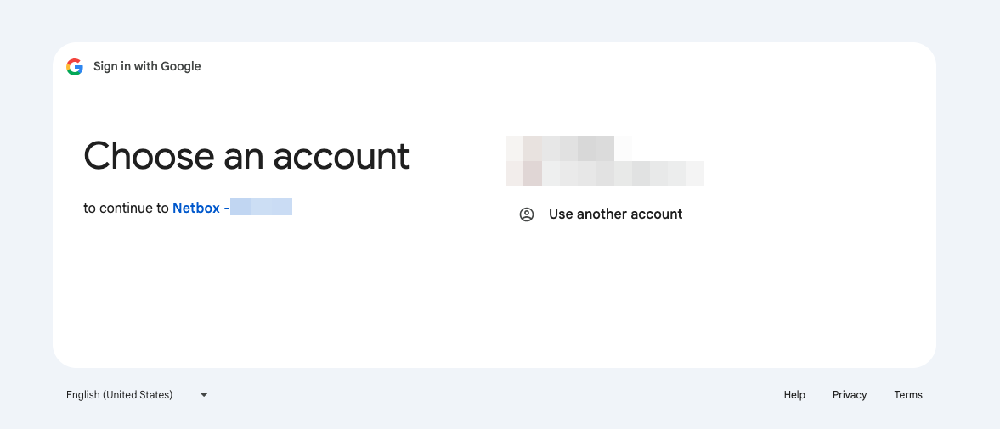

# Google

NetBox supports single sign-on (SSO) with Google, so users can log in with their existing Google credentials instead of separate NetBox account credentials.

This centralizes access control and simplifies user management, letting administrators grant or revoke NetBox access directly from Google.

For more information, see [Using OAuth 2.0 for Web Server Applications](https://developers.google.com/identity/protocols/oauth2/web-server).

## Prerequisites

Before configuring Google authentication, ensure you have:

**Google requirements:**

* A Google Cloud project, and permission to create OAuth credentials within it
* Test user account for validation (optional but recommended)

**NetBox requirements:**

* Access to `configuration.py` and permission to restart the NetBox services
* HTTPS configured for production deployments
* Your NetBox URL (used for redirect URI configuration)

!!! note
    Google requires the NetBox hostname to use a public top-level domain (e.g. `.com`, `.net`). The use of IP addresses is not permitted (except `127.0.0.1`).

## Google configuration

### Configure the consent screen

1. Log into the [Google Cloud console](https://console.cloud.google.com/) and create a new project for NetBox, or select an existing one.

2. Under **APIs & Services**, open the **OAuth consent screen**.

3. Select the user type:

    * **Internal**: Only users within your Google Workspace organization can log in. This option is available only to Workspace customers.
    * **External**: Any Google account can log in, subject to the publishing status described below.

4. Enter the required app information, such as the app name, user support email, and developer contact address.

!!! note "Publishing status"
    While an external app's publishing status is **Testing**, only the accounts listed as test users on the consent screen can log in; everyone else is refused. Publish the app when you are ready to allow general access.

### Create OAuth credentials

1. Under **APIs & Services**, open **Credentials**, click **Create Credentials**, and select **OAuth client ID**.

2. Select **Web application** as the application type.

3. Complete the following fields:

    * **Name**: Enter a name for the client (e.g. "NetBox").

    * **Authorized JavaScript origins**: Enter the URL of your NetBox installation.

        For example: `https://<your-netbox-domain>`

    * **Authorized redirect URIs**: Enter the path to your NetBox installation, ending with `/oauth/complete/google-oauth2/`.

        For example: `https://<your-netbox-domain>/oauth/complete/google-oauth2/`

4. Click **Create**, then note the **Client ID** and **Client secret**. You will need these when configuring NetBox.

!!! warning
    Treat the client secret as a credential. Store it securely, and rotate it if it may have been exposed.

## NetBox configuration

### Enter configuration parameters

Add the following configuration to `configuration.py`, substituting your own values:

```python
REMOTE_AUTH_BACKEND = 'social_core.backends.google.GoogleOAuth2'
SOCIAL_AUTH_GOOGLE_OAUTH2_KEY = '{CLIENT_ID}'
SOCIAL_AUTH_GOOGLE_OAUTH2_SECRET = '{CLIENT_SECRET}'
```

* `CLIENT_ID` is the **Client ID** you copied from the **Credentials** page for your NetBox OAuth client.
* `CLIENT_SECRET` is the **Client secret** you copied from the **Credentials** page for your NetBox OAuth client.

### Restrict access by domain (optional)

An external OAuth client accepts any Google account by default. To limit logins to one or more domains, add the following to `configuration.py`:

```python
SOCIAL_AUTH_GOOGLE_OAUTH2_WHITELISTED_DOMAINS = ['example.com']
```

Individual addresses may be permitted with `SOCIAL_AUTH_GOOGLE_OAUTH2_WHITELISTED_EMAILS`. See the [python-social-auth documentation](https://python-social-auth.readthedocs.io/en/latest/backends/google.html) for details.

### Restart NetBox

Configuration changes require restarting the application. This is typically done with the command below:

```no-highlight
sudo systemctl restart netbox
```

## Testing

Log out of NetBox and click the "Log In" button at top right. You should see the normal login form as well as an option to authenticate using Google.

Click the option to log in with Google.



You will be redirected to Google's authentication portal where you can log in with your test user's Google credentials. You may also be prompted to grant this application access to your account.



If successful, you will be redirected back to the NetBox UI, and will be logged in as the Google user. You can verify this by clicking your login ID in the upper right and selecting **Profile**.

This user account is now replicated within NetBox, and can be assigned groups and permissions.

## Assign permissions

New users have no permissions by default. To assign permissions:

1. From NetBox, navigate to **Admin > Authentication > Users** (requires admin access).

2. Locate the Google user and assign appropriate groups or individual [permissions](../permissions.md).

3. Set [staff or superuser status](../../models/users/user.md), if needed:

    * **Staff**: Allows the user to log into the legacy Django admin site. Most NetBox functionality is exposed via the standard UI, so staff status is rarely needed.
    * **Superuser**: Grants the user all permissions implicitly, bypassing all permission checks.

!!! warning "Security considerations"
    Exercise extreme caution when configuring Superuser users or groups.

    Superusers have unrestricted access to NetBox and can:

    * Modify any data, including configuration
    * Elevate other users to superuser status

## Troubleshooting

### Redirect URI does not match

Google requires that the authenticating client request a redirect URI that matches one of the authorized redirect URIs you configured for the OAuth client. A mismatch produces a `redirect_uri_mismatch` error.

This URI must begin with `https://` (unless using `127.0.0.1` for development) and must match **exactly** what you configured in Google (including the trailing slash). The redirect URI is where Google sends users after authentication. NetBox uses the following pattern:

```text
https://<your-netbox-domain>/oauth/complete/google-oauth2/
```

If Google complains that the requested URI starts with `http://` (not HTTPS), it's likely that your HTTP server is misconfigured or sitting behind a load balancer, so NetBox is not aware that HTTPS is being used. To force the use of an HTTPS redirect URI, set the following in `configuration.py` per the [python-social-auth docs](https://python-social-auth.readthedocs.io/en/latest/configuration/settings.html#processing-redirects-and-urlopen):

```python
SOCIAL_AUTH_REDIRECT_IS_HTTPS = True
```

Note that changes to an OAuth client in the Google Cloud console can take some time to propagate.

### Access blocked during authentication

If Google refuses the login with an error such as "access_denied" before the user reaches NetBox, the account is not permitted to use the OAuth client.

Check the consent screen configuration: an app with a publishing status of **Testing** admits only the accounts listed as test users, and an **Internal** app admits only accounts within your Google Workspace organization. Add the account as a test user, publish the app, or adjust the user type as appropriate.

### Not logged in after authenticating

If you are redirected to the NetBox UI after authenticating successfully, but are not logged in, double-check the `REMOTE_AUTH_BACKEND` value configured in `configuration.py` against your Google OAuth client.

The instructions provided above are only applicable to the `google.GoogleOAuth2` backend. Confirm too that `SOCIAL_AUTH_GOOGLE_OAUTH2_KEY` matches the client ID in Google, and that `SOCIAL_AUTH_GOOGLE_OAUTH2_SECRET` is the secret value rather than its ID.

If you have restricted access by domain, confirm that the account's domain appears in `SOCIAL_AUTH_GOOGLE_OAUTH2_WHITELISTED_DOMAINS`.
