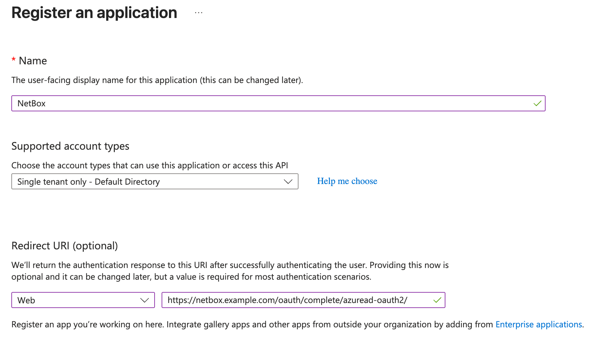
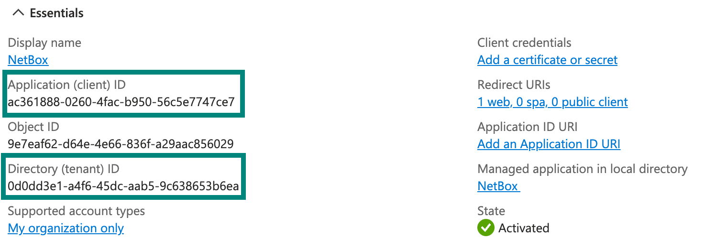
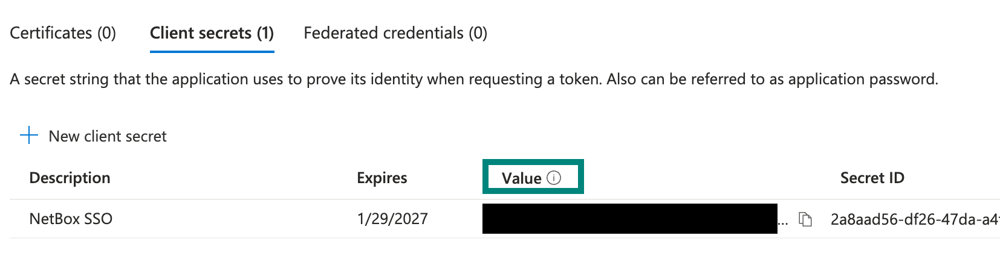
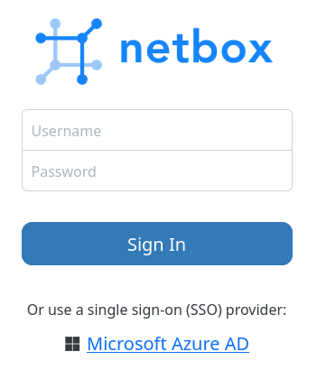
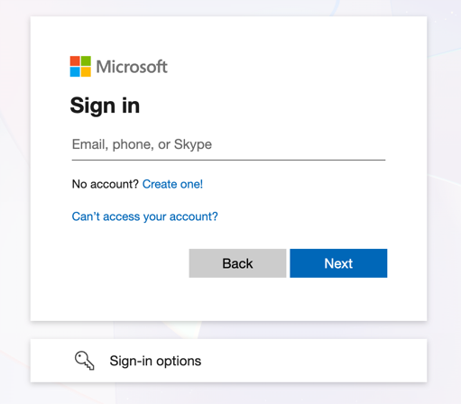

# Microsoft Entra ID

NetBox supports single sign-on (SSO) with [Microsoft Entra ID](https://www.microsoft.com/en-us/security/business/identity-access/microsoft-entra-id) (formerly Azure Active Directory), so users can log in with their existing Microsoft credentials instead of separate NetBox account credentials.

This centralizes access control and simplifies user management, letting administrators grant or revoke NetBox access directly from Entra ID.

## Prerequisites

Before configuring Entra ID authentication, ensure you have:

**Microsoft Entra ID requirements:**

* Permissions to create app registrations in Entra ID
* Test user account for validation (optional but recommended)

**NetBox requirements:**

* Access to `configuration.py` and permission to restart the NetBox services
* HTTPS configured for production deployments
* Your NetBox URL (used for redirect URI configuration)

## Entra ID configuration

!!! tip
    We recommend that you first [create a new Entra ID user](https://learn.microsoft.com/en-us/entra/fundamentals/how-to-create-delete-users) for testing.

    You can skip this step if you already have a suitable account created.

### Register an app

Begin by registering an app for NetBox.

1. Open the [Microsoft Entra admin center](https://entra.microsoft.com/#home) and select **Entra ID > App registrations** in the left menu.

2. Click **New registration**.

3. Complete the following fields:

    * **Name**: Enter a name for the registration (e.g. "NetBox").

    * **Account type**: Select the single-tenant option.

        !!! tip "Multitenant authentication"
            NetBox also supports multitenant authentication via Entra ID. However, this requires a different backend and an additional configuration parameter. See [Multitenant authentication](#multitenant-authentication) below.

    * **Redirect URI**: Select **Web** and enter the path to your NetBox installation, ending with `/oauth/complete/azuread-oauth2/`.

        For example: `https://<your-netbox-domain>/oauth/complete/azuread-oauth2/`

        Note:

        * Use HTTPS in production (HTTP only allowed for localhost testing)
        * This must match exactly what you configure in Entra ID (including the trailing slash)

    

4. Note the application (client) ID and the directory (tenant) ID. You will need these when configuring SSO from NetBox.

    

### Create a secret

1. From the page for your new NetBox app registration, select **Certificates & secrets** in the menu on the left.

2. Under **Client secrets**, click **New client secret**.

3. Provide a description and optionally select an expiration period.

4. After creating the secret, note its **Value** (not the secret ID). You will need this when configuring NetBox.

    

!!! warning
    This value is only displayed once; copy it immediately.

## NetBox configuration

### Enter configuration parameters

Add the following configuration to `configuration.py`, replacing the placeholder values:

```python
REMOTE_AUTH_BACKEND = 'social_core.backends.azuread.AzureADOAuth2'
SOCIAL_AUTH_AZUREAD_OAUTH2_KEY = '{APPLICATION_ID}'
SOCIAL_AUTH_AZUREAD_OAUTH2_SECRET = '{SECRET_VALUE}'
```

* `APPLICATION_ID` is the **Application (client) ID** you copied from the **Overview** page for your NetBox app registration.
* `SECRET_VALUE` is the **Value** you copied from the **Certificates & secrets** page for your NetBox app registration.

!!! note
    If you are deploying multitenant authentication, you will need to use a different `REMOTE_AUTH_BACKEND` backend. See [Multitenant authentication](#multitenant-authentication) below.

### Restart NetBox

Configuration changes require restarting the application. This is typically done with the command below:

```no-highlight
sudo systemctl restart netbox
```

## Testing

Log out of NetBox and click the "Log In" button at top right. You should see the normal login form as well as an option to authenticate using Entra ID.

Click the option to log in with Microsoft Entra ID.



You will be redirected to Microsoft's authentication portal where you can log in with your test user's Microsoft credentials. You may also be prompted to grant this application access to your account.



If successful, you will be logged in as the Entra ID user. You can verify this by clicking your login ID in the upper right and selecting **Profile**.

This user account is now replicated within NetBox, and can be assigned groups and permissions.

## Assign permissions

New users have no permissions by default. To assign permissions:

1. From NetBox, navigate to **Admin > Authentication > Users** (requires admin access).

2. Locate the Entra ID user and assign appropriate groups or individual [permissions](../permissions.md).

3. Set [staff or superuser status](../../models/users/user.md), if needed:

    * **Staff**: Allows the user to log into the legacy Django admin site. Most NetBox functionality is exposed via the standard UI, so staff status is rarely needed.
    * **Superuser**: Grants the user all permissions implicitly, bypassing all permission checks.

!!! warning "Security considerations"
    Exercise extreme caution when configuring Superuser users or groups.

    Superusers have unrestricted access to NetBox and can:

    * Modify any data, including configuration
    * Elevate other users to superuser status

## Multitenant authentication

NetBox supports multitenant authentication for organizations using multiple Entra ID tenants. This requires a different backend configuration.

**Multitenant backend:**

```python
REMOTE_AUTH_BACKEND = 'social_core.backends.azuread_tenant.AzureADTenantOAuth2'
SOCIAL_AUTH_AZUREAD_TENANT_OAUTH2_KEY = '{APPLICATION_ID}'
SOCIAL_AUTH_AZUREAD_TENANT_OAUTH2_SECRET = '{SECRET_VALUE}'
SOCIAL_AUTH_AZUREAD_TENANT_OAUTH2_TENANT_ID = '{TENANT_ID}'
```

When creating the app registration, select **Multiple Entra ID tenants** instead of single tenant.

For detailed multitenant configuration, refer to the [Python Social Auth documentation](https://python-social-auth.readthedocs.io/en/latest/backends/azuread.html#tenant-support).

## Troubleshooting

### Redirect URI does not match

Entra ID requires that the authenticating client request a redirect URI that matches the one you configured for the app registration.

This URI must begin with `https://` (unless using `localhost` for the domain) and must match **exactly** what you configured in Entra ID (including the trailing slash). The redirect URI is where Entra ID sends users after authentication. NetBox uses the following pattern:

```text
https://<your-netbox-domain>/oauth/complete/azuread-oauth2/
```

If Entra ID complains that the requested URI starts with `http://` (not HTTPS), it's likely that your HTTP server is misconfigured or sitting behind a load balancer, so NetBox is not aware that HTTPS is being used. To force the use of an HTTPS redirect URI, set the following in `configuration.py` per the [python-social-auth docs](https://python-social-auth.readthedocs.io/en/latest/configuration/settings.html#processing-redirects-and-urlopen):

```python
SOCIAL_AUTH_REDIRECT_IS_HTTPS = True
```

### Not logged in after authenticating

If you are redirected to the NetBox UI after authenticating successfully, but are not logged in, double-check the `REMOTE_AUTH_BACKEND` value configured in `configuration.py` against your Entra ID app registration.

The instructions provided above are only applicable to the `azuread.AzureADOAuth2` backend using a single-tenant app registration. Confirm too that `SOCIAL_AUTH_AZUREAD_OAUTH2_KEY` matches the application (client) ID in Entra ID, and that `SOCIAL_AUTH_AZUREAD_OAUTH2_SECRET` is the secret value rather than its ID.

### Expired client secret

If authentication fails and you see an error such as "invalid_client" or "secret expired", this means your client secret has expired.

Generate a new client secret in Entra ID, update `configuration.py` with the new value, and restart the NetBox services.

To prevent this, we recommend setting a calendar reminder to rotate and update your secret.
