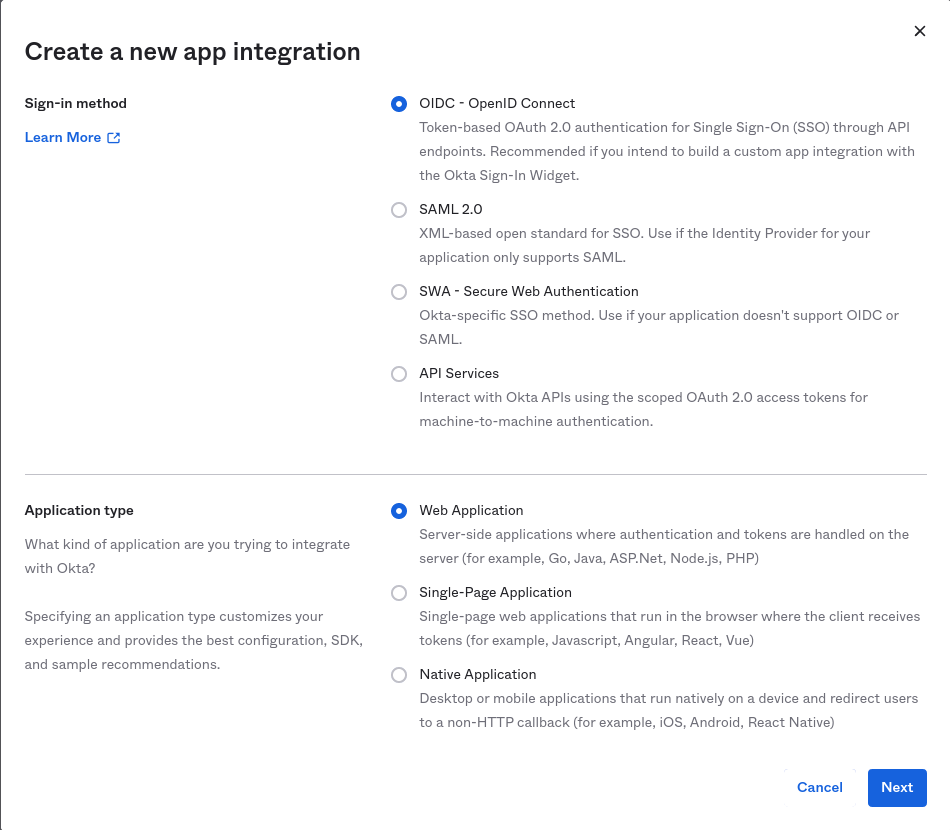
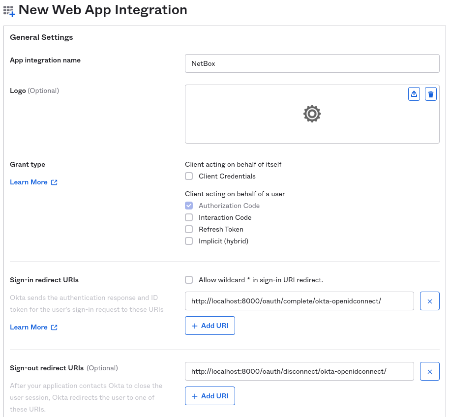
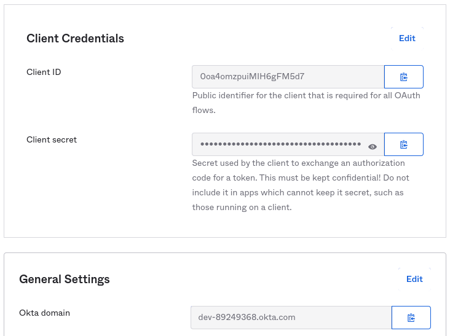
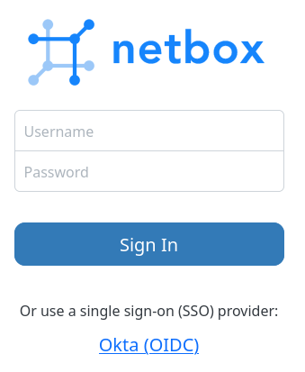
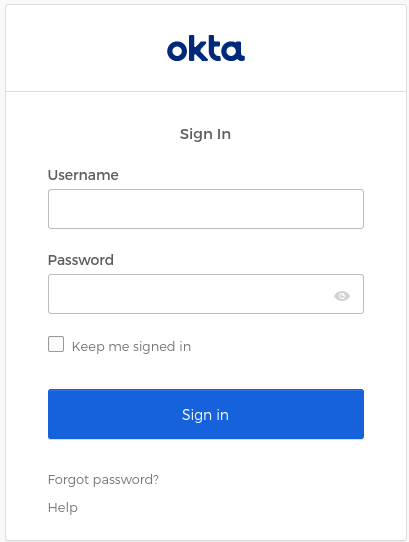

# Okta

NetBox supports single sign-on (SSO) with [Okta](https://www.okta.com/), so users can log in with their existing Okta credentials instead of separate NetBox account credentials.

This centralizes access control and simplifies user management, letting administrators grant or revoke NetBox access directly from Okta.

For more information, see [OpenID Connect app integrations](https://help.okta.com/en-us/content/topics/apps/apps-about-oidc.htm). Okta also offers [free developer accounts](https://developer.okta.com/) if you want to evaluate SSO before rolling it out.

## Prerequisites

Before configuring Okta authentication, ensure you have:

**Okta requirements:**

* Permission to create app integrations in the Okta Admin Console
* Test user account for validation (optional but recommended)

**NetBox requirements:**

* Access to `configuration.py` and permission to restart the NetBox services
* HTTPS configured for production deployments
* Your NetBox URL (used for redirect URI configuration)

## Okta configuration

!!! tip
    We recommend that you first [create a new Okta user](https://help.okta.com/en-us/content/topics/users-groups-profiles/usgp-add-users.htm) for testing.

    You can skip this step if you already have a suitable account created.

### Create an app integration

1. In the Okta Admin Console, select **Applications and Resources > Applications** in the left menu.

2. Click **Create App Integration**.

3. Select **OIDC - OpenID Connect** as the sign-in method and **Web Application** as the application type, then click **Next**.

    

4. Complete the following fields:

    * **App integration name**: Enter a name for the integration (e.g. "NetBox").

    * **Grant type**: Select **Authorization Code**.

    * **Sign-in redirect URIs**: Enter the path to your NetBox installation, ending with `/oauth/complete/okta-openidconnect/`.

        For example: `https://<your-netbox-domain>/oauth/complete/okta-openidconnect/`

    * **Sign-out redirect URIs**: `https://<your-netbox-domain>/oauth/disconnect/okta-openidconnect/`

    * **Assignments**: Under **Controlled access**, choose how users get access to NetBox:

        * **Limit access to selected groups**: Enter the names of the groups that should have access.
        * **Allow everyone in your organization to access**: Any user in your Okta org can log in.
        * **Skip group assignment for now**: Nobody can log in until you assign users or groups on the integration's **Assignments** tab.

    

5. Click **Save**.

!!! warning "Note on Federation Broker Mode"
    Selecting **Allow everyone in your organization to access** offers **Enable immediate access with Federation Broker Mode**. That mode provides [SSO without pre-assigning the app to users](https://help.okta.com/oie/en-us/content/topics/apps/apps-fbm-main.htm). In this mode, the integration's sign-on policy alone governs access, so Okta keeps no assignment records and there is nothing for your groups to be assigned to. Okta [doesn't support group assignments](https://help.okta.com/oie/en-us/content/topics/apps/apps-fbm-known-issues.htm) in this mode, and NetBox won't appear on your users' Okta End-User Dashboard.

    You can [disable Federation Broker Mode](https://help.okta.com/oie/en-us/content/topics/apps/apps-fbm-disable.htm) later from the **Federation Broker Mode** section of the integration's **General** tab. Okta restores assignments once the background process finishes.

### Note the integration parameters

1. From the page for your new NetBox app integration, select the **General** tab.

2. Under **Client Credentials**, note the **Client ID** and the **Client secret**. You will need these when configuring NetBox.

    

3. Note your Okta domain, shown under **Settings > Account** in the Admin Console and in the account menu at top right (for example, `dev-123456.okta.com`).

!!! warning
    Treat the client secret as a credential. Store it securely, and rotate it if it may have been exposed.

## NetBox configuration

### Enter configuration parameters

Add the following configuration to `configuration.py`, substituting your own values:

```python
REMOTE_AUTH_BACKEND = 'social_core.backends.okta_openidconnect.OktaOpenIdConnect'
SOCIAL_AUTH_OKTA_OPENIDCONNECT_KEY = '{CLIENT_ID}'
SOCIAL_AUTH_OKTA_OPENIDCONNECT_SECRET = '{CLIENT_SECRET}'
SOCIAL_AUTH_OKTA_OPENIDCONNECT_API_URL = 'https://{OKTA_DOMAIN}/oauth2/'
```

* `CLIENT_ID` is the **Client ID** you copied from the **General** tab for your NetBox app integration.
* `CLIENT_SECRET` is the **Client secret** you copied from the **General** tab for your NetBox app integration.
* `OKTA_DOMAIN` is your Okta domain, such as `dev-123456.okta.com`.

The API URL ends with `/oauth2/` for the default Okta authorization server. If you use a custom authorization server, use `/oauth2/{AUTH_SERVER_ID}/` instead.

### Restart NetBox

Configuration changes require restarting the application. This is typically done with the command below:

```no-highlight
sudo systemctl restart netbox
```

## Testing

Log out of NetBox and click the "Log In" button at top right. You should see the normal login form as well as an option to authenticate using Okta.

Click the option to log in with Okta.



You will be redirected to Okta's authentication portal where you can log in with your test user's Okta credentials. You may also be prompted to grant this application access to your account.



If successful, you will be redirected back to the NetBox UI, and will be logged in as the Okta user. You can verify this by clicking your login ID in the upper right and selecting **Profile**.

This user account is now replicated within NetBox, and can be assigned groups and permissions.

## Assign permissions

New users have no permissions by default. To assign permissions:

1. From NetBox, navigate to **Admin > Authentication > Users** (requires admin access).

2. Locate the Okta user and assign appropriate groups or individual [permissions](../permissions.md).

3. Set [staff or superuser status](../../models/users/user.md), if needed:

    * **Staff**: Allows the user to log into the legacy Django admin site. Most NetBox functionality is exposed via the standard UI, so staff status is rarely needed.
    * **Superuser**: Grants the user all permissions implicitly, bypassing all permission checks.

!!! warning "Security considerations"
    Exercise extreme caution when configuring Superuser users or groups.

    Superusers have unrestricted access to NetBox and can:

    * Modify any data, including configuration
    * Elevate other users to superuser status

## Troubleshooting

### Redirect URI does not match

Okta requires that the authenticating client request a redirect URI that matches a sign-in redirect URI you configured in the app integration.

This URI must begin with `https://` and must match **exactly** what you configured in Okta (including the trailing slash). The redirect URI is where Okta sends users after authentication. NetBox uses the following pattern:

```text
https://<your-netbox-domain>/oauth/complete/okta-openidconnect/
```

If Okta complains that the requested URI starts with `http://` (not HTTPS), it's likely that your HTTP server is misconfigured or sitting behind a load balancer, so NetBox is not aware that HTTPS is being used. To force the use of an HTTPS redirect URI, set the following in `configuration.py` per the [python-social-auth docs](https://python-social-auth.readthedocs.io/en/latest/configuration/settings.html#processing-redirects-and-urlopen):

```python
SOCIAL_AUTH_REDIRECT_IS_HTTPS = True
```

### User is not assigned to the application

If authentication fails with an error such as "User is not assigned to the client application", the account you are testing with has no assignment to the NetBox app integration.

In the Okta Admin Console, open the integration and add the user, or a group the user belongs to, under **Assignments**.

### Not logged in after authenticating

If you are redirected to the NetBox UI after authenticating successfully, but are not logged in, double-check the `REMOTE_AUTH_BACKEND` value configured in `configuration.py` against your Okta app integration.

The instructions provided above are only applicable to the `okta_openidconnect.OktaOpenIdConnect` backend. Confirm too that `SOCIAL_AUTH_OKTA_OPENIDCONNECT_SECRET` is the secret value rather than its ID, and that `SOCIAL_AUTH_OKTA_OPENIDCONNECT_API_URL` points at the authorization server the integration uses.

### Expired client secret

If authentication fails and you see an error such as "invalid_client" or "secret expired", this means your client secret has expired.

Generate a new client secret in Okta, update `configuration.py` with the new value, and restart the NetBox services.

To prevent this, we recommend setting a calendar reminder to rotate and update your secret.
