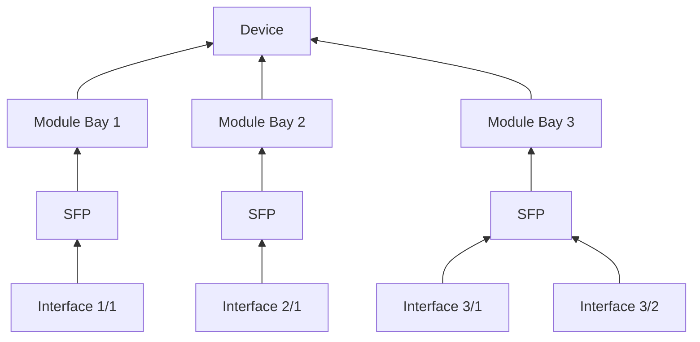

# Modeling Pluggable Transceivers

## Use Case

Many network devices utilize field-swappable [small-form factor pluggable transceivers (SFPs)](https://en.wikipedia.org/wiki/Small_Form-factor_Pluggable) to enable changing the physical media type of a fixed interface. For example, a 10 Gigabit Ethernet interface might be connected using copper, multimode fiber, or single-mode fiber, each of which requires a different type of SFP+ transceiver.

It can be challenging to model SFPs given their dynamic nature. This guide intends to capture the recommended strategy for modeling SFPs on NetBox v4.4 and later.

## Modeling Strategy

Pluggable transceivers are most accurately represented in NetBox as discrete [modules](../models/dcim/module.md) which are installed within [module bays](../models/dcim/modulebay.md). A module can deliver one or more [interfaces](../models/dcim/interface.md) (or other components) to the device in which it is installed. This approach ensures that a new interface is automatically created on the device when the module is installed, and deleted when the module is removed.

### 1. Create an SFP Module Type Profile

If one has not already been defined, create a [module type profile](../models/dcim/moduletypeprofile.md) for SFPs. This profile will be assigned for all module types which represent a pluggable transceiver. Typically, you will need only one profile for all pluggable transceivers.

You might opt to define custom attributes for the profile by defining a custom [JSON schema](https://json-schema.org/). Profile attributes might be used to define characteristics unique to transceivers, such as optical wavelength and power ranges. Adding profile attributes is optional, and can be done at a later point.

!!! note
    Creating a module type profile is optional, but recommended as it allows for defining custom module attributes.

### 2. Create a Module Type for Each SFP Model in Inventory

Next, create a [module type](../models/dcim/moduletype.md) to represent each unique SFP model present in your network. Each module type should define a manufacturer and a unique model name, and may also include a part number. For example, you might create a module type for each of the following transceivers:

| Manufacturer | Model            | Media Type |
|--------------|------------------|------------|
| Cisco        | SFP-10G-SR       | 10GE MMF   |
| Cisco        | SFP-10G-LR       | 10GE SMF   |
| Juniper      | QFX-QSFP-40G-SR4 | 40GE MMF   |
| Juniper      | JNP-QSFP-DAC-5M  | 40GE DAC   |

### 3. Add an Interface to the Module Type

After creating each module type, create an interface template on it to represent its physical interface. The definition of this interface template will depend on the transceiver's physical media type. (Reference the table above for examples.) When a new module is "installed" within a module bay on a device, its templated interface(s) will be automatically instantiated on that device as child interfaces of the module.

Determining which name to use for the transceiver's interface can be tricky, as the interface name might depend on the type of device in which the SFP is installed. To avoid having to rename interfaces, consider using the `{module}` token in place of a static interface name. The interface's name will inherit the position of the bay in which its parent module is installed. If creating multiple interfaces on a module, be sure to append a unique ID (e.g. `{module}:1`) to ensure each interface gets assigned a unique name.

### 4. Create Device Types

If you haven't already, create a [device type](../models/dcim/devicetype.md) to represent each unique device model in your network.

!!! note
    Skip this step if you've already created the necessary device types.

### 5. Add Module Bays to the Device Type

Once you've created a device type, add the appropriate number of module bays on each device type to represent its SFP slots. For example, a Juniper QFX5110 would have module bays numbered `0/0/0` through `0/0/55`: 48 SFP+ bays and 8 QSFP28 bays (56 total).

Be sure to define both the name **and position** of each module bay with a unique value. The module bay's position will be used to automatically name SFP interfaces.

### 6. Create a Device

Create a new device using the device type added in the previous step. The module bays (and any other components) defined on the device type will be instantiated on the new device automatically.

!!! note
    If you've already created the necessary devices in NetBox, you'll need to add their module bays manually. You can add multiple module bays at once by selecting the desired devices from the device list and selecting **Add Components > Module Bays** at the bottom of the page.

### 7. Add the SFP Modules

Finally, create each SFP in the new device by "installing" a new module of the appropriate type in each module bay. The interface(s) defined on the selected module type will be automatically populated on the new module. If present, the `{module}` token in the name of each interface template will be replaced with the position of the bay in which the module is being installed. For example, an interface template with the name `et-{module}` being created on a module installed in a bay with position `0/0/14` will create an interface named `et-0/0/14`.

When adding many modules at once, you may find it helpful to utilize NetBox's bulk import functionality. This allows you to create many modules at once from CSV, JSON, or YAML data.
