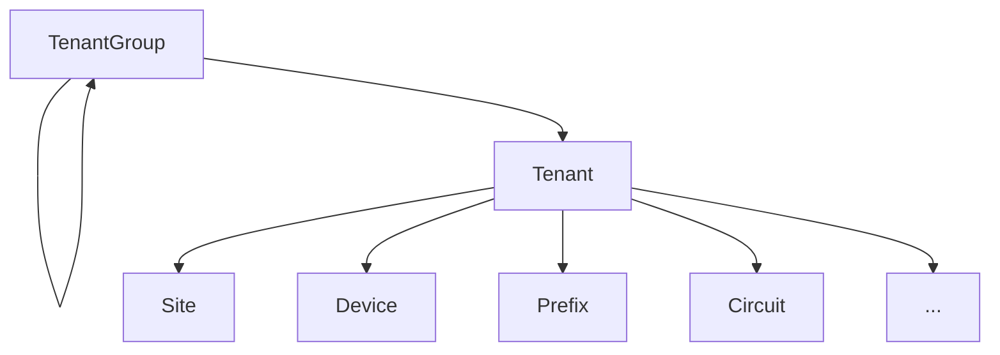

# Tenancy

Most core objects within NetBox's data model support _tenancy_. This is the association of an object with a particular tenant to convey assignment or dependency. For example, an enterprise might represent its internal business units as tenants, whereas a managed services provider might create a tenant in NetBox to represent each of its customers.

## Tenant Groups

Tenants can be grouped by any logic that your use case demands, and groups can be nested recursively for maximum flexibility. For example, You might define a parent "Customers" group with child groups "Current" and "Past" within it. A tenant can be assigned to a group at any level within the hierarchy.

## Tenants

Typically, the tenant model is used to represent a customer or internal organization, however it can be used for whatever purpose meets your needs.

Most core objects within NetBox can be assigned to a particular tenant, so this model provides a very convenient way to correlate resource allocation across object types. For example, each of your customers might have its own racks, devices, IP addresses, circuits and so on: These can all be easily tracked via tenant assignment.

The following objects can be assigned to tenants:

* Circuits
* Circuit groups
* Virtual circuits
* Cables
* Devices
* Virtual device contexts
* Power feeds
* Racks
* Rack reservations
* Sites
* Locations
* ASNs
* ASN ranges
* Aggregates
* Prefixes
* IP ranges
* IP addresses
* VLANs
* VLAN groups
* VRFs
* Route targets
* Clusters
* Virtual machines
* L2VPNs
* Tunnels
* Wireless LANs
* Wireless links

Tenancy represents the dedication of an object to a specific tenant. As such, each object may only be assigned to a single tenant. For example, if you have a firewall dedicated to a particular customer, you would assign it to the tenant which represents that customer. However, if the firewall serves multiple customers, it doesn't *belong* to any particular customer, so the assignment of a tenant would not be appropriate.
