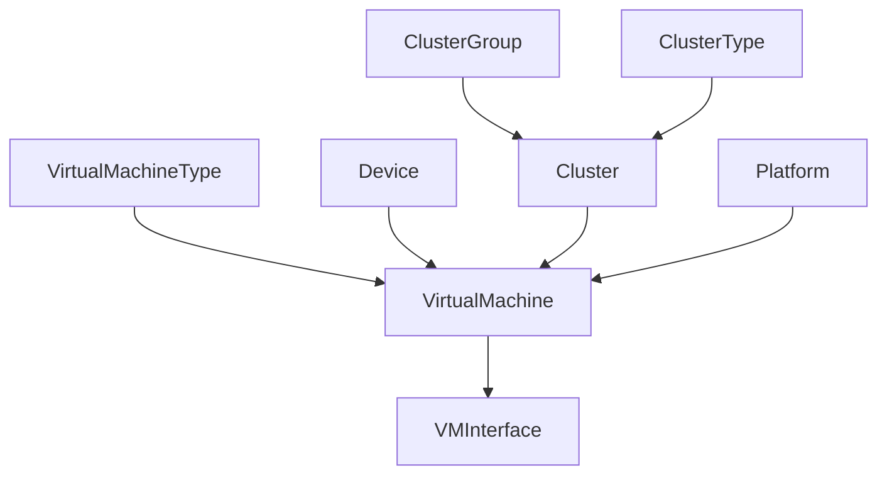

# Virtualization

Virtual machines, clusters, and standalone hypervisors can be modeled in NetBox alongside physical infrastructure. IP addresses and other resources are assigned to these objects just like physical objects, providing a seamless integration between physical and virtual networks.

## Clusters

A cluster is one or more physical host devices on which virtual machines can run.

Each cluster must have a type and operational status, and may be assigned to a group. (Both types and groups are user-defined.) Each cluster may designate one or more devices as hosts, however this is optional.

## Virtual Machine Types

A virtual machine type provides reusable classification for virtual machines and can define create-time defaults for platform, vCPUs, and memory. This is useful when multiple virtual machines share a common sizing or profile while still allowing per-instance overrides after creation.

## Virtual Machines

A virtual machine is a virtualized compute instance. These behave in NetBox very similarly to device objects, but without any physical attributes.

For example, a VM may have interfaces assigned to it with IP addresses and VLANs, however its interfaces cannot be connected via cables (because they are virtual). Each VM may define its compute, memory, and storage resources as well. A VM can optionally be assigned a [virtual machine type](../models/virtualization/virtualmachinetype.md) to classify it and provide default values for selected attributes at creation time.

A VM can be placed in one of three ways:

- Assigned to a site alone for logical grouping.
- Assigned to a cluster and optionally pinned to a specific host device within that cluster.
- Assigned directly to a standalone device that does not belong to any cluster.
