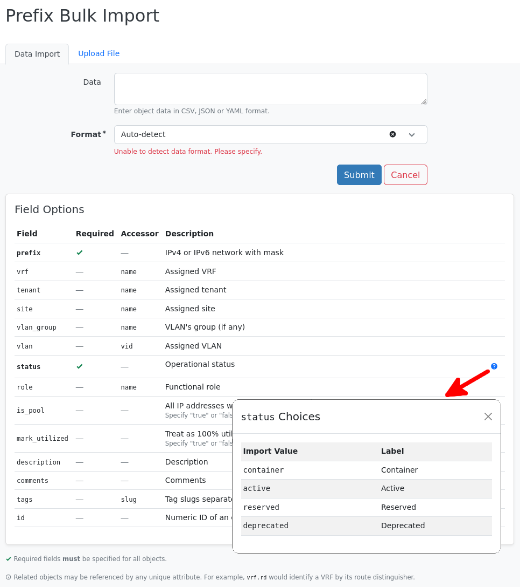

# Populating Data

This section covers the mechanisms which are available to populate data in NetBox.

## Manual Object Creation

The simplest and most direct way of populating data in NetBox is to use the object creation forms in the user interface.

!!! warning "Not Ideal for Large Imports"
    While convenient and readily accessible to even novice users, creating objects one at a time by manually completing these forms obviously does not scale well. For large imports, you're generally best served by using one of the other methods discussed in this section.

To create a new object in NetBox, find the object type in the navigation menu and click the green "Add" button.

!!! info "Missing Button?"
    If you don't see an "add" button for certain object types, it's likely that your account does not have sufficient permission to create these types. Ask your NetBox administrator to grant the required permissions.
    
    Also note that some object types, such as device components, cannot be created directly from the navigation menu. These must be created within the context of a parent object (such as a parent device).

<!-- TODO: Screenshot -->

## Bulk Import (CSV/YAML)

NetBox supports the bulk import of new objects, and updating of existing objects using CSV-formatted data. This method can be ideal for importing spreadsheet data, which is very easy to convert to CSV data. CSV data can be imported either as raw text using the form field, or by uploading a properly formatted CSV file.

When viewing the CSV import form for an object type, you'll notice that the headers for the required columns have been pre-populated. Each form has a table beneath it titled "CSV Field Options," which lists _all_ supported columns for your reference. (Generally, these map to the fields you see in the corresponding creation form for individual objects.)

If an "id" field is added the data will be used to update existing records instead of importing new objects.

Note that some models (namely device types and module types) do not support CSV import. Instead, they accept YAML-formatted data to facilitate the import of both the parent object as well as child components.

### Export/Import/Update/Delete CSV falls and pitfalls

Import tool is useful for newcomers. It allows you to import data you have outside the Netbox, but there are details you should know in advance.

There are Export tool and Import tool, but they can't be directly used reversible and it is intentionally designed that way. There is no tool which exports same file as Import tool requires.

There is no separate Update tool. Import tool checks presence of "id" column. When "id" column is present in input data, it tries to find a row by "id" column and if found, it tries to update it. If row is not found by "id", error is shown. When no "id" column is presented, Import tool tries to create new record for every row and fails when duplicate is going to be created.

!!! info "Update tool"
    Update tool is available from version 3.4

There is no Delete tool - means delete records based on records in input file.

Export tool exports data as they shown - names of items, item values formatted, multiple data columns joined into one common export column etc. On the other hand Import tool requires key values, item value as raw data, each import column must match one data column.

To avoid confusion in file format, Export tool uses multiword upper case column names columns and Import uses lower case underscore separated column names. E.g. "Type" vs. "type" or "Rear port" vs. "rear_port". Import column names are shown in Bulk Import dialog shown above.

Enumeration items are exported as shown, by its label (e. g. "Active" for device status or "8P8C" for port type), but for Import tool key value must be used (e. g. "active" or "8p8c"). Key value can be found by clicking on question mark on right side of a row in Bulk Import dialog.

There is no difference in data between Import and Update except there must be "id" column for Update. It is same value as Export column "ID", but it is presented just in "All Data (CSV)" export template.

Some exports combine multiple data rows into one column (e. g. Front port export combines Rear port name and Rear port label into one column). There is no way how to recognize it export or avoid it. If you would like to use same data for import, you must manually edit the data.

### How to prepare file for Import/Update based on Exported data

1. Export data. If you would like to update existing data, use "All Data (CSV)" export template to receive "ID" column.
2. Change CSV file header, its column names:
  - lower case column names
  - join multiwords by _
  - check new column names in Bulk Import dialog
3. Check enumeration columns and convert data from label to key value.

    Now you have data in correct format.

4. Edit data you would like to import or update.
  - For import, remove existing data rows and create new ones
  - For update, update rows you need
5. Use Bulk Import dialog and import data. If error is shown, fix it and repeat the import.

## Scripting

Sometimes you'll find that data you need to populate in NetBox can be easily reduced to a pattern. For example, suppose you have one hundred branch sites and each site gets five VLANs, numbered 101 through 105. While it's certainly possible to explicitly define each of these 500 VLANs in a CSV file for import, it may be quicker to draft a simple custom script to automatically create these VLANs according to the pattern. This ensures a high degree of confidence in the validity of the data, since it's impossible for a script to "miss" a VLAN here or there.

!!! tip "Reconstruct Existing Data with Scripts"
    Sometimes, you might want to write a script to populate objects even if you have the necessary data ready for import. This is because using a script eliminates the need to manually verify existing data prior to import.

## REST API

You can also use the REST API to facilitate the population of data in NetBox. The REST API offers full programmatic control over the creation of objects, subject to the same validation rules enforced by the UI forms. Additionally, the REST API supports the bulk creation of multiple objects using a single request.

For more information about this option, see the [REST API documentation](../integrations/rest-api.md).
