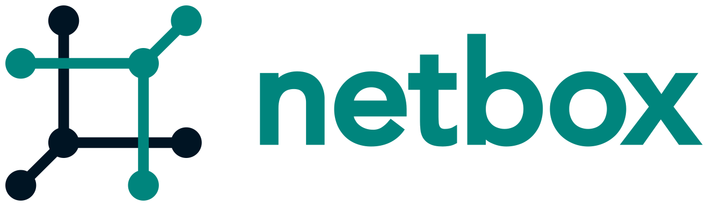

# NetBox 是什么?

 NetBox是一个开源的web应用程序，旨在帮助管理和记录计算机网络。NetBox最初由 [DigitalOcean](https://www.digitalocean.com/) 的网络工程团队为满足网络和基础设施工程师的管理需求而提议并实现的。它包括网络管理的以下方面： 

* **IP address management (IPAM)** - IP 网络管地址, VRFs, 和 VLANs
* **Equipment racks** - 按组和站点进行组织
* **Devices** - 设备类型及其安装位置
* **Connections** -  设备之间的网络、控制台和电源连接 
* **Virtualization** - 虚拟机和群集
* **Data circuits** - 长途通信电路和供应商
* **Secrets** - 加密存储敏感凭证

##  NetBox 不能做什么

NetBox覆盖网络管理的许多领域，但其功能集的范围必然是受限的。这确保了在核心功能上集中开发，并合理控制范围的蔓延。NetBox **不** 提供如下功能： 

* 网络监视
* DNS 服务器
* RADIUS 服务器
* 配置管理
* 设施管理 

也就是说, NetBox _能_ 非常有效地使用外部工具来满足这些功能要求。

## 设计理念

NetBox基于以下原则设计： 

### 复制真实世界

对数据模型进行了仔细的考虑，以确保它能够准确地反映真实世界的网络。例如，IP地址不是分配给设备，而是分配给连接到设备的特定接口，并且一个接口可能有多个IP地址分配给它。 

### 充当“真理之源” 

NetBox旨在表示网络的 _期望_ 状态与 _操作_ 状态。因此，强烈建议自动导入实时网络状态。所有在NetBox中创建的数据都应该首先由人工来审核，以确保其完整性。然后可以使用高度可信的NetBox来实现监视和资源调配。

### 保持简单

当在一个相对简单的[80%解决方案](https://en.wikipedia.org/wiki/Pareto_principle)和一个更复杂的完整解决方案之间进行选择时，通常前者会更受到青睐。这确保了代码库具有低的学习曲线。

## 应用程序技术栈

NetBox构建在[Django](https://djangoproject.com/)这一Python框架之上，并利用了[PostgreSQL](https://www.postgresql.org/)数据库。它以WSGI服务方式运行HTTP服务器。

| 功能           | 组件         |
|--------------------|-------------------|
| HTTP 服务       | nginx or Apache   |
| WSGI 服务       | gunicorn or uWSGI |
| 应用        | Django/Python     |
| 数据库           | PostgreSQL 9.6+   |
| 任务队列       | Redis/django-rq   |
| 在线设备访问 | NAPALM            |

## 受支持的 Python 版本

NetBox 当前支持 Python 3.6 and 3.7 环境. (NetBox v2.8 开始移除了 Python 3.5 支持)

## 快速开始

查看 [安装指南](installation/index%20zh-cn.md) 以快速启动和运行NetBox .
