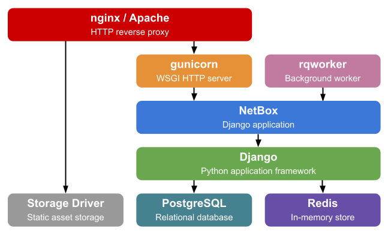

# 安装

以下章节详细说明了如何安装一个新的 NetBox 实例:

1. [PostgreSQL 数据库](1-postgresql%20zh-cn.md)
1. [Redis](2-redis%20zh-cn.md)
3. [NetBox 组件](3-netbox%20zh-cn.md)
4. [HTTP 服务](4-http-daemon.md)
5. [LDAP 认证](5-ldap.md) (可选)

下面是NetBox应用程序技术栈的简述，以供参考：

## 升级

如果您从一个已有的安装进行升级, 请参考 [升级指南](upgrading.md).

Netbox v2.5.9及更高版本使用systemd替代了supervord。  如果您目前还是使用 supervisord ，请参阅说明 [升级到 systemd](migrating-to-systemd.md) .
