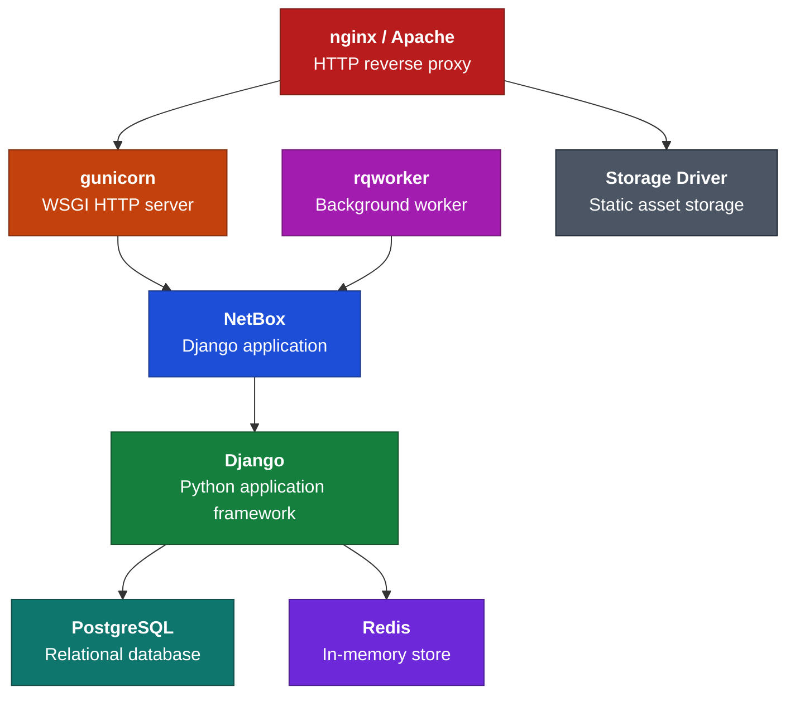

# Installation

-   :material-clock-fast:{ .lg .middle } __Eager to Get Started?__

    ---

    Check out the [NetBox Cloud Free Plan](https://netboxlabs.com/free-netbox-cloud/)! Skip the installation process and grab your own NetBox Cloud instance, preconfigured and ready to go in minutes. Completely free!

    [:octicons-arrow-right-24: Sign Up](https://signup.netboxlabs.com/)

The installation instructions provided here have been tested to work on Ubuntu 24.04. The particular commands needed to install dependencies on other distributions may vary significantly. Unfortunately, this is outside the control of the NetBox maintainers. Please consult your distribution's documentation for assistance with any errors.

The following sections detail how to set up a new instance of NetBox:

1. [PostgreSQL database](1-postgresql.md)
2. [Redis](2-redis.md)
3. Install the NetBox application using either:
    * a [release archive or Git checkout](3-netbox.md); or
    * the [Python package](3b-python-package.md) (experimental)
4. [Gunicorn](4a-gunicorn.md) or [uWSGI](4b-uwsgi.md)
5. [HTTP server](5-http-server.md)
6. [LDAP authentication](6-ldap.md) (optional)

!!! warning "Experimental Python package installation"
    Installing NetBox from the Python package is experimental in NetBox v4.7 and is not recommended for production use. It is intended for evaluation and feedback. The release archive and Git workflows remain supported and are the established installation methods.

## Requirements

| Dependency | Supported Versions |
|------------|--------------------|
| Python     | 3.12, 3.13, 3.14   |
| PostgreSQL | 15+                |
| Redis      | 6.0+               |

Below is a simplified overview of the NetBox application stack for reference:

## Upgrading

If you are upgrading from an existing installation, please consult the [upgrading guide](upgrading.md).
